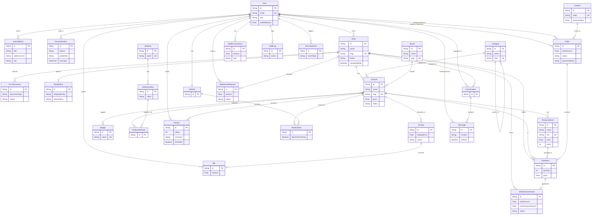

# Database ER Diagram

Here is the Entity Relationship (ER) diagram mapping out the full PostgreSQL database schema for the Active E-commerce platform.

```mermaid
erDiagram
    %% Core Entities
    User {
        String id PK
        String email UK
        String role
        Float walletBalance
    }
    
    UserAddress {
        String id PK
        String title
        String addressLine1
        String city
    }

    DeviceSession {
        String id PK
        String device
        String ipAddress
        DateTime lastLogin
    }
    
    Shop {
        String id PK
        String name
        String slug UK
        String status
        Boolean vacationMode
    }

    %% Shop Resources
    KYCDocument {
        String id PK
        String documentType
        String status
    }
    
    ShopPolicy {
        String id PK
        String shippingPolicy
        String returnPolicy
    }

    %% Product & Catalog
    Product {
        String id PK
        String name
        String slug UK
        Float price
        String status
    }
    
    ProductVariant {
        String id PK
        String name
        String sku UK
        Float price
        Int stock
    }

    Category {
        String id PK
        String name
        String slug UK
    }

    Brand {
        String id PK
        String name
        String slug UK
    }

    Badge {
        String id PK
        String name UK
    }

    Attribute {
        String id PK
        String name UK
    }

    AttributeValue {
        String id PK
        String value
    }

    ProductAttribute {
        String id PK
    }

    %% Customer Engagement
    Review {
        String id PK
        Int rating
        String comment
        Boolean isVerified
    }
    
    Wishlist {
        String id PK
    }
    
    WishlistItem {
        String id PK
        Boolean alertOnPriceDrop
    }
    
    Auction {
        String id PK
        Float startingPrice
        String status
    }
    
    Bid {
        String id PK
        Float amount
    }

    Conversation {
        String id PK
    }
    
    Message {
        String id PK
        String content
        Boolean isRead
    }

    %% Orders & Transactions
    Order {
        String id PK
        Float totalAmount
        String status
        String paymentStatus
    }
    
    OrderItem {
        String id PK
        Int quantity
        Float price
    }
    
    Coupon {
        String id PK
        String code UK
        Float discountValue
    }

    %% Finance
    VendorCommission {
        String id PK
        Float totalAmount
        Float commissionAmount
        String status
    }
    
    WithdrawalRequest {
        String id PK
        Float amount
        String status
    }

    WalletTransaction {
        String id PK
        Float amount
        String type
    }
    
    StaffLog {
        String id PK
        String action
    }
    
    SecurityEvent {
        String id PK
        String eventType
    }

    %% Relationships Mapping

    %% User Relations
    User ||--o{ UserAddress : "saves"
    User ||--o{ DeviceSession : "logs_in"
    User ||--o{ Shop : "owns"
    User ||--o{ Order : "places (Customer)"
    User ||--o{ Order : "assigned (Driver)"
    User ||--o| Wishlist : "has"
    User ||--o{ Review : "writes"
    User ||--o{ Bid : "places"
    User ||--o{ Message : "sends/receives"
    User ||--o{ Conversation : "engaged_in"
    User ||--o{ WithdrawalRequest : "makes"
    User ||--o{ WalletTransaction : "has"
    User ||--o{ StaffLog : "logs"
    User ||--o{ SecurityEvent : "triggers"

    %% Shop Relations
    Shop ||--o{ Product : "lists"
    Shop ||--o{ OrderItem : "fulfills"
    Shop ||--o{ VendorCommission : "earns"
    Shop ||--o{ KYCDocument : "submits"
    Shop ||--o{ WithdrawalRequest : "requests"
    Shop ||--o| ShopPolicy : "defines"
    Shop ||--o{ Conversation : "engaged_in"

    %% Product Relations
    Product ||--o{ ProductVariant : "has"
    Product ||--o{ OrderItem : "in"
    Product }o--o{ Badge : "tagged"
    Product ||--o{ ProductAttribute : "features"
    Product ||--o{ Review : "receives"
    Product ||--o{ WishlistItem : "saved_as"
    Product ||--o{ Auction : "featured_in"
    Category ||--o{ Product : "categorizes"
    Category ||--o{ Category : "parent_of"
    Brand ||--o{ Product : "brands"

    %% Variant & Orders
    ProductVariant ||--o{ OrderItem : "included_in"
    Order ||--o{ OrderItem : "contains"
    Coupon ||--o{ Order : "used_on"
    OrderItem ||--o| VendorCommission : "generates"

    %% Attributes
    Attribute ||--o{ AttributeValue : "has"
    AttributeValue ||--o{ ProductAttribute : "mapped_via"

    %% Wishlist
    Wishlist ||--o{ WishlistItem : "contains"

    %% Auctions
    Auction ||--o{ Bid : "receives"

    %% Chat
    Conversation ||--o{ Message : "contains"
```
